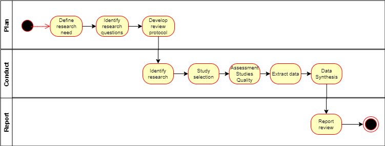

# Research methodology
The importance to understand customer dropout and the diversity of employed algorithms requires an understanding of trends and existing problems to create a ground base of knowledge. For the development of the systematic literature review was adopted, the methodology applied by Kitchenham & Charters (2007) developed in three stages: Plan, Conduct and Report, as described in the following figure:



Research goals is to understand What is the current state of machine learning research studies to predict dropout in contractual settings? 
Based in this were identified five research questions to determine the main aspects related to the customer dropout with contractual settings:
```
RQ1. What studies have been published? 
RQ2. Which algorithms have been used to predict the dropout?
RQ3. What are the more relevant features related to predicting customer dropout? 
RQ4. When the dropout occurs? 
RQ5. What is the accuracy of the machine learning algorithms to predict dropout? 
```

# Activity 6: State of the art
Consider the identification of type of machine learning algorithms according business area. This allows to identify which algorithms are used in each business area to address dropout. 

# Activity 7: Current situation


# Methodology SLR
All searches where limited to the time interval between 2000 and 2020. Limited to articles in english.

## Parsifal
("research papers about dropout with contractual settings" OR "membership") AND ("machine learning to predict dropout" OR "churn") AND ("investigations founds") AND ("not applicable for this research")


((“customer dropout”) OR (“customer churn”) AND “machine learning” AND (“contractual” OR “membership”))

## Scopus
Search: 20_08_2020
https://www.scopus.com/results/results.uri?sort=plf-f&src=s&sid=841eb157c55d7eb4b10662211622e11a&sot=a&sdt=a&cluster=scosubtype%2c%22ar%22%2ct%2c%22cp%22%2ct%2bscolang%2c%22English%22%2ct&sl=149&s=ALL+%28+customer+AND+%28+%28dropout+%29+OR+%28+%22churn%22+%29+%29+AND+%22machine+learning%22+AND+%28+%22contractual%22+OR+%22membership%22+%29+%29+AND+PUBYEAR+%3e+1999+AND+PUBYEAR+%3c+2021&origin=cto&editSaveS=&txGid=751219e5fa081a46ec24053c168c70ad

### Query with contractual
ALL ( customer  AND  ( ( dropout )  OR  ( "churn" ) )  AND  "machine learning"  AND  ( "contractual"  OR  "membership" ) )  AND  PUBYEAR  >  1999  AND  PUBYEAR  <  2021  AND  ( LIMIT-TO ( DOCTYPE ,  "ar" )  OR  LIMIT-TO ( DOCTYPE ,  "cp" ) )  AND  ( LIMIT-TO ( LANGUAGE ,  "English" ) )  
__Results__ = 210

### Query without contractual
ALL ( customer  AND  ( ( dropout )  OR  ( "churn" ) )  AND  "machine learning" )  AND  PUBYEAR  >  1999  AND  PUBYEAR  <  2021  AND  ( LIMIT-TO ( DOCTYPE ,  "ar" )  OR  LIMIT-TO ( DOCTYPE ,  "cp" ) )  AND  ( LIMIT-TO ( LANGUAGE ,  "English" ) )  

__Results__ = 2000

[Scopus Studies selection (bibtex)](scopus/scopus.bib)

## IEEE Digital Library
Search: 21_08_2020
https://ieeexplore.ieee.org/search/searchresult.jsp?queryText=((%E2%80%9Ccustomer%20dropout%E2%80%9D)%20OR%20(%E2%80%9Ccustomer%20churn%E2%80%9D)%20AND%20%E2%80%9Cmachine%20learning%E2%80%9D%20AND%20(%E2%80%9Ccontractual%E2%80%9D%20OR%20%E2%80%9Cmembership%E2%80%9D))&highlight=true&returnFacets=ALL&returnType=SEARCH&matchPubs=true&ranges=2000_2020_Year

(((“customer") AND  ("dropout" OR “churn”)) AND “machine learning” AND (“contractual” OR “membership”))


__results__:20

## SpringerLink
Search: 21_08_2020
(("customer dropout"or "customer churn") and "machine learning" and (contractual* or membership)) 
https://link.springer.com/search?query=%28%28%22customer+dropout%22or+%22customer+churn%22%29+and+%22machine+learning%22+and+%28contract*+or+membership%29%29+&date-facet-mode=between&facet-start-year=2000&previous-start-year=1997&facet-end-year=2021&previous-end-year=2021

__results__:79

## Science@Direct
Search: 21_08_2020
(((“customer") AND  ("dropout" OR “churn”)) AND “machine learning” AND (“contractual” OR “membership”))

https://www.sciencedirect.com/search?qs=%28%28%28%E2%80%9Ccustomer%22%29%20AND%20%20%28%22dropout%22%20OR%20%E2%80%9Cchurn%E2%80%9D%29%29%20AND%20%E2%80%9Cmachine%20learning%E2%80%9D%20AND%20%28%E2%80%9Ccontractual%E2%80%9D%20OR%20%E2%80%9Cmembership%E2%80%9D%29%29&date=2000-2020&show=100&offset=100

__Results__:126

## ISI Web of Science
Search: 21_08_2020
(("customer dropout"or "customer churn") and "machine learning" and (contractual or membership)) 
https://apps.webofknowledge.com/Search.do?product=UA&SID=E5YD2nJO9BseQ2L2G2V&search_mode=GeneralSearch&prID=d77c3de4-5ff9-4e31-a913-3dc06f30f206


TS=(customer  AND ( dropout  OR  churn)  AND  "machine learning" ) Timespan: 2000-2020. Databases:  WOS, CCC, DIIDW, KJD, MEDLINE, RSCI, SCIELO. Search language=Auto
__results__:110


TS=(customer   AND  ( dropout OR churn)  AND  "machine  learning"  AND  (contractual or membership)) Databases= WOS, CCC, DIIDW, KJD, MEDLINE, RSCI, SCIELO Timespan=2000-2020 Search language=Auto   
__results__:6

## ACM Digital Library
Search: 20_08_2020
https://dl.acm.org/action/doSearch?fillQuickSearch=false&expand=dl&AfterYear=2000&BeforeYear=2018&AllField=%28%E2%80%9Ccustomer+dropout%E2%80%9D%29+OR+%28%E2%80%9Ccustomer+churn%E2%80%9D%29+AND+%E2%80%9Cmachine+learning%E2%80%9D+AND+%28%E2%80%9Ccontractual%E2%80%9D+OR+%E2%80%9Cmembership%E2%80%9D%29

```
Full Query Sintax:
"query": { (“customer dropout”) OR (“customer churn”) AND “machine learning” AND (“contractual” OR “membership”) } 
"filter": { Publication Date: (01/01/2000 TO 12/31/2018), ACM Content: DL, NOT VirtualContent: true }
```
__results__: 8

Full Query Sintax:
"query": { AllField:((“customer dropout”) OR (“customer churn”) AND “machine learning”) }
"filter": { Publication Date: (01/01/2000 TO 12/31/2020), ACM Content: DL, NOT VirtualContent: true }
__results__: 86

## Data Analysis
Articles identified in the initial dataset

|Source 		|Articles|
|---------------|-------:|
|Scopus			|	  210|
|IEEE			|	   20|
|Springer 		|	   79|
|Science Direct	|     126|
|WoS 			|       6|
|ACM 			|	    8|
|Total			|	  449|


Science Direct incomplete items where 8, Scopus 11 and IEEE 1. Remaining 429. 16 duplicates removed 424. ASReview (van de Schoot et al., 2020) filtering process:
1.	Selected randomly some articles and are identified as relevant and irrelevant, at least 5 each. ASReview suggests when to stop;
2.	ASReview orders the publications in such a way that you see the most relevant publications first
3.	Stopping criterium could be stopping after n presented abstracts were labeled irrelevant, or if your time is up. You can use the chart in the statistics panel to follow your progress" 

Data processing is available in a [R Script](analysis/bibtexCleaning.html) 

