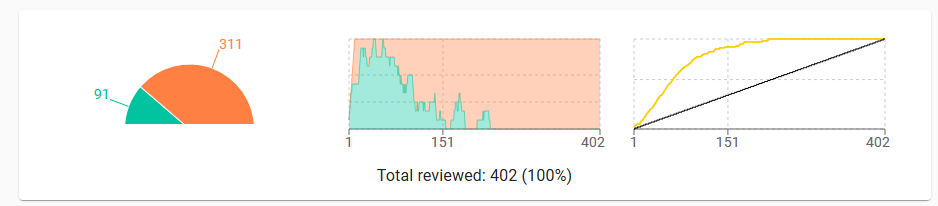

This is an [R Markdown](http://rmarkdown.rstudio.com) Notebook. With the cleaning of a dataframe used in a Systematic Review. 
https://cran.r-project.org/web/packages/bibtex/bibtex.pdf


This was tested with bib2df version 1.1.1, installation instructions available [here][1], 
and one example [here][2]. Github project is available [here][3]

[1]: https://docs.ropensci.org/bib2df/
[2]: https://docs.ropensci.org/bib2df/articles/bib2df.html
[3]: https://github.com/ropensci/bib2df

Is better to confirm that the files are in UTF-8 encoding. 
The bibtex files must be checked. There should be spaces between "=":
```
@Article{Binmore2008,
  Title = {Do Conventions Need to Be Common Knowledge?},
  Author = {Binmore, Ken},
  Journal = {Topoi},
  Year = {2008},
  Number = {1},
  Pages = {17--27},
  Volume = {27}
}
```
This code correct that:
```
tx<-readLines(file)
tx2<-gsub(pattern = "=\\{",replacement = " = {",x = tx)
writeLines(text = tx2,con = 'corrected_scopus.bib')

```

# Import Libraries

```{r message=FALSE, warning=FALSE}
# Setup library
library(bib2df)
library(bibtex)
library(tibble)
library(dplyr)

setwd('C:/nuvem/Dropbox/doutoramento/tese/SLRDropout/analysis')
```

List all the files with bib extension

```{r}
files<-list.files(path = 'articles/',pattern = '\\.bib$')
files
```
Reading bibtex source files

# ACM
```{r warning=FALSE}
acm<-bib2df(file = 'articles/acm.bib')
#str(acm)
acm2<-read.bib(file = 'articles/acm.bib',encoding = 'UTF8')
str(acm)

names(acm)
#Exclude some columns not required for the analysis
acm <- acm %>% select(-c(CHAPTER:INSTITUTION,KEY:ORGANIZATION,ANNOTE,SCHOOL,TYPE,ISSUE_DATE))
str(acm)
```


# IEEE
```{r}
ieee<-bib2df(file = 'articles/ieee.bib')
names(ieee)
dim(ieee)

```
# Science Direct
```{r}
science1<-bib2df(file = 'articles/scienceDirect_withContractual1.bib')
dim(science1)
science2<-bib2df(file = 'articles/scienceDirect_withContractual2.bib')
dim(science2)

#merge two dataframes
science <- rbind(science1,science2)
dim(science)

names(science)

ls() # check object in workspace
#remove dataframes
rm(science1)
rm(science2)

```
Incorrect data discarded 8 incomplete information tot
```{r}
dim(science)
length(unique(science$ABSTRACT))
```
There are 6 entries without abstract. 
```{r}

science_Abstract <- science %>% filter(is.na(ABSTRACT)) %>% select(TITLE,ABSTRACT,URL,DOI)
str(science_Abstract)
unique(science_Abstract$TITLE)
```
```{r}
science_Abstract$TITLE
```
The entries aren't articles, we will remove them.

```{r}
science_correct <- science %>% filter(!is.na(ABSTRACT)) 

```

# Scopus
```{r warning=FALSE}
scopus <- bib2df('articles/scopus.bib')
dim(scopus)
names(scopus)

```

```{r}
unique(scopus$ABSTRACT)
```
Only 2 articles with a abstract. Getting the abstract of the articles.

This code gets the abstract using the paper link
We are going to use (rvest)[http://rvest.tidyverse.org/]
The xpath was identified using Firefox:
1. Inspect in the abstract
2. Right click > Copy > XPath:
```
/html/body/div[1]/div[1]/div[1]/div[2]/div[1]/div[3]/div[3]/div[1]/div[1]/div[2]/div[2]/section[7]/p
```

```{r}
library(rvest)
library(httr)
library(utils)

#select the articles without abstract
scopus_abstract <- scopus %>% filter(is.na(ABSTRACT)) 

print("Progress Scopus:")

pb = txtProgressBar(min = 0, max = length(scopus_abstract$URL), initial = 0,); i<-1
#springer$URL

for (x in scopus_abstract$URL) {
    url<-x
    webpage<-GET(url,timeout(300))
    webpage<-read_html(webpage)
    xpathAbstract <- '/html/body/div[1]/div[1]/div/div[2]/div/div[3]/div/div[1]/div[1]/div[2]/div[1]/section[7]/p'
    abstract<-html_text(html_nodes(webpage,xpath = xpathAbstract ))
    #print(abstract)
    if(length(abstract!=0)) { 
      scopus$ABSTRACT[scopus$URL==x]=abstract 
      }
    setTxtProgressBar(pb,i)    
    i<-i+1
}

```
# Springer
```{r}
springer<-bib2df('articles/springer_Exported Items.bib')

names(springer)
```
The bibtex file extracted from Springer don't have abstract. We have to recreate that. We will use the same approach
that was done to Scopus.
Get the node with abstract using the css selector .c-article-section__content or .Para. An easy way is to identify the css selector is to use the inspector.

```{r}
#Replace the abstract with same link
springer$ABSTRACT = NA

print("Progress springer:")
pb = txtProgressBar(min = 0, max = length(springer$URL), initial = 0,); i<-1
#springer$URL
for (x in springer$URL) {
    url<-x
    webpage<-GET(url,timeout(300))
    webpage<-read_html(webpage)
    if(length(html_nodes(webpage,'.c-article-section__content')) != 0)
    {
        abstract<-html_text(html_nodes(webpage,'.c-article-section__content')[1])
    
    } else {
        abstract<-html_text(html_nodes(webpage,'.Para')[1])
    }
    #print(abstract)
    if(length(abstract!=0)) { springer$ABSTRACT[springer$URL==x]=abstract }
    setTxtProgressBar(pb,i)    
    i<-i+1
}

```

```{r}
ls()
```
Checking springer articles without abstract
```{r}
dim(springer)

springer %>% filter(is.na(ABSTRACT)) %>% select(TITLE,URL,ABSTRACT,URL,DOI)
```


Replacing missing abstracts
```
DOI = 10.1007/3-540-28433-8_9
https://www.scholars.northwestern.edu/en/publications/applications-of-intelligent-technologies-in-retail-marketing
Abstract: Over the last two decades, various \"intelligent technologies\" for database analyses have significantly impacted on the design and development of new decision support systems and expert systems in diverse disciplines such as engineering, science, medicine, economics, social sciences and management. So far, however, barring a few noteworthy retailing applications reported in the academic literature, the use of intelligent technologies in retailing management practice is still quite limited. This chapter's objective is to acquaint the reader with the potential of these technologies to provide novel, effective solutions to a number of complex retail management decision problems, as well as stimulating more research and development of such solutions in practice.

DOI = 	10.1057/palgrave.jors.2602597
https://www.tandfonline.com/doi/full/10.1057/palgrave.jors.2602597
Abstract: From its foundation, operational research (OR) has made many substantial contributions to practical forecasting in organizations. Equally, researchers in other disciplines have influenced forecasting practice. Since the last survey articles in JORS, forecasting has developed as a discipline with its own journals. While the effect of this increased specialization has been a narrowing of the scope of OR's interest in forecasting, research from an OR perspective remains vigorous. OR has been more receptive than other disciplines to the specialist research published in the forecasting journals, capitalizing on some of their key findings. In this paper, we identify the particular topics of OR interest over the past 25 years. After a brief summary of the current research in forecasting methods, we examine those topic areas that have grabbed the attention of OR researchers: computationally intensive methods and applications in operations and marketing. Applications in operations have proved particularly important, including the management of inventories and the effects of sharing forecast information across the supply chain. The second area of application is marketing, including customer relationship management using data mining and computer-intensive methods. The paper concludes by arguing that the unique contribution that OR can continue to make to forecasting is through developing models that link the effectiveness of new forecasting methods to the organizational context in which the models will be applied. The benefits of examining the system rather than its separate components are likely to be substantial.
```

```{r}
abstract = "Over the last two decades, various \"intelligent technologies\" for database analyses have significantly impacted on the design and development of new decision support systems and expert systems in diverse disciplines such as engineering, science, medicine, economics, social sciences and management. So far, however, barring a few noteworthy retailing applications reported in the academic literature, the use of intelligent technologies in retailing management practice is still quite limited. This chapter's objective is to acquaint the reader with the potential of these technologies to provide novel, effective solutions to a number of complex retail management decision problems, as well as stimulating more research and development of such solutions in practice."
springer$ABSTRACT[springer$DOI=='10.1007/3-540-28433-8_9']=abstract

abstract="From its foundation, operational research (OR) has made many substantial contributions to practical forecasting in organizations. Equally, researchers in other disciplines have influenced forecasting practice. Since the last survey articles in JORS, forecasting has developed as a discipline with its own journals. While the effect of this increased specialization has been a narrowing of the scope of OR's interest in forecasting, research from an OR perspective remains vigorous. OR has been more receptive than other disciplines to the specialist research published in the forecasting journals, capitalizing on some of their key findings. In this paper, we identify the particular topics of OR interest over the past 25 years. After a brief summary of the current research in forecasting methods, we examine those topic areas that have grabbed the attention of OR researchers: computationally intensive methods and applications in operations and marketing. Applications in operations have proved particularly important, including the management of inventories and the effects of sharing forecast information across the supply chain. The second area of application is marketing, including customer relationship management using data mining and computer-intensive methods. The paper concludes by arguing that the unique contribution that OR can continue to make to forecasting is through developing models that link the effectiveness of new forecasting methods to the organizational context in which the models will be applied. The benefits of examining the system rather than its separate components are likely to be substantial."
springer$ABSTRACT[springer$DOI=='10.1057/palgrave.jors.2602597']=abstract
```


# Web of Knowledge
```{r}
wos<-bib2df('articles/webofscience_Exported Items.bib')
wAbstract<-wos[is.na(wos$ABSTRACT),]
dim(wAbstract)
# two articles without abstract
urls<-wAbstract$URL
wos$ABSTRACT[wos$URL==urls[1]]<-'Customer churn management focuses on identifying potential churners and implementing incentives that can cure churn. The success of a churn management program depends on accurately identifying potential churners and understanding what conditions contribute to churn. However, in the presence of uncertainties in the process of churn, such as competing risks and unpredictable customer behaviour, the accuracy of the prediction models can be limited. To overcome this, we employ a competing risk methodology within a random survival forest framework that accurately computes the risks of churn and identifies relationships between the risks and customer behaviour. In contrast to existing methods, the proposed model does not rely on a specific functional form to model the relationships between risk and behaviour, and does not have underlying distributional assumptions, both of which are limitations faced in practice. The performance of the method is evaluated using data from a membership-based firm in the hospitality industry, where customers face two competing churning events. The proposed model improves prediction accuracy by up to 20%, compared to conventional models. The findings from this work can allow marketers to identify and understand churners, and develop strategies on how to design and implement incentives.'

wos$ABSTRACT[wos$URL==urls[2]]<-'Predicting future customer behavior provides key information for efficiently directing resources at sales and marketing departments. Such information supports planning the inventory at the warehouse and point of sales, as well strategic decisions during manufacturing processes. In this paper, we develop advanced analytics tools that predict future customer behavior in the non-contractual setting. We establish a dynamic and data driven framework for predicting whether a customer is going to make purchase at the company within a certain time frame in the near future. For that purpose, we propose a new set of customer relevant features that derives from times and values of previous purchases. These customer features are updated every month, and state of the art machine learning algorithms are applied for purchase prediction. In our studies, the gradient tree boosting method turns out to be the best performing method. Using a data set containing more than 10 000 customers and a total number of 200 000 purchases we obtain an accuracy score of 89% and an AUC value of 0.95 for predicting next moth purchases on the test data set.'

incomplete<-wos$TITLE[is.na(wos$DOI)]

incomplete
wos$DOI[wos$TITLE=="A {Case} of {Churn} {Prediction} in {Telecommunications} {Industry"]='10.1007/978-3-319-10774-5_8'
wos$DOI[wos$TITLE=="Churn {Prediction} {Model} for {Effective} {Gym} {Customer} {Retention"]='10.1109/BESC.2017.8256385'
wos$DOI[wos$TITLE=="Using machine learning techniques to preduct defection of top clients"]='10.2495/DATA020491'

```
# Create a dataframe for analysis
```{r}
acm2<-data.table::copy(acm)
data_articles <- data.frame(acm$CATEGORY,acm$YEAR,acm$TITLE,acm$ABSTRACT,acm$DOI,acm$JOURNAL,acm$BIBTEXKEY,
                            sapply(acm$AUTHOR,FUN=toString))

names(data_articles)<- c('category','year','title','abstract','doi','journal','bibtexkey','author')
data_articles$source <- 'ACM'


#Transform the vector to string
ieee$AUTHOR <- sapply(ieee$AUTHOR,FUN=toString)
science$AUTHOR <- sapply(science$AUTHOR,FUN=toString)
scopus$AUTHOR <- sapply(scopus$AUTHOR,FUN=toString)
springer$AUTHOR <- sapply(springer$AUTHOR,FUN=toString)
wos$AUTHOR <- sapply(wos$AUTHOR,FUN=toString)

#IEEE
if(!exists('ieee2')){
    ieee2<-data.table::copy(ieee) #Copy the dataset
    ieee<-ieee2 %>% select(CATEGORY,YEAR,TITLE,ABSTRACT,DOI,JOURNAL,BIBTEXKEY,AUTHOR )
    names(ieee)<-c('category','year','title','abstract','doi','journal','bibtexkey','author')
    ieee$source <-'IEEE'
    
    data_articles<-rbind(data_articles,ieee)
}  

#SCIENCE
if(!exists('science2')){
    science2<-data.table::copy(science)
    science<-science2 %>% select(CATEGORY,YEAR,TITLE,ABSTRACT,DOI,JOURNAL,BIBTEXKEY,AUTHOR )
    names(science)<-c('category','year','title','abstract','doi','journal','bibtexkey','author')
    science$source <- 'SCIENCE'
  
    data_articles<-rbind(data_articles,science)
}

#SCOPUS
if(!exists('scopus2')){
    scopus2<-data.table::copy(scopus) 
    scopus<-scopus2 %>% select(CATEGORY,YEAR,TITLE,ABSTRACT,DOI,JOURNAL,BIBTEXKEY,AUTHOR )
    names(scopus)<-c('category','year','title','abstract','doi','journal','bibtexkey','author')
    scopus$source <- 'SCOPUS'
  
    data_articles<-rbind(data_articles,scopus)
}

#SPRINGER
if(!exists('springer2')){
    springer2<-data.table::copy(springer)
    springer<-springer2 %>% select(CATEGORY,YEAR,TITLE,ABSTRACT,DOI,JOURNAL,BIBTEXKEY,AUTHOR )
    names(springer)<-c('category','year','title','abstract','doi','journal','bibtexkey','author')
    springer$source <- 'SPRINGER'

    data_articles<-rbind(data_articles,springer)
}

#WOS
if(!exists('wos2')){
    wos2<-data.table::copy(wos) #Copy the dataset
    wos<-wos2 %>% select(CATEGORY,YEAR,TITLE,ABSTRACT,DOI,JOURNAL,BIBTEXKEY,AUTHOR )
    names(wos)<-c('category','year','title','abstract','doi','journal','bibtexkey','author')
    wos$source <- 'WOS'

    data_articles<-rbind(data_articles,wos)
}

str(data_articles)
data_articles
```

#Remove duplicates
## Check duplicates

```{r include=FALSE}
unique(data_articles$title)
```
## Remove { replacing by ''
```{r}
# Remove { or } from title
# Escape metacaracthers in R is with \\
data_articles$title<-gsub("\\{|\\}","",data_articles$title)
data_articles$author<-gsub("\\{|\\}","",data_articles$author)

```
```{r include=FALSE}
unique(data_articles$title)
```
```{r}
dim(data_articles)
length(unique(data_articles$title))
```
Article number without duplicates 448
Number articles with duplicates 420

## Remove duplicates
```{r}
write.xlsx(data_articles,'data/data_articles.xlsx')
data_articles_w_duplicates<-data_articles %>% distinct(title,.keep_all = TRUE)
dim(data_articles_w_duplicates)
```

#Final cleanup
```{r warning=FALSE}
#Check null abstracts
#View(data_articles[is.na(data_articles$abstract),])

missing_abstracts<-data_articles_w_duplicates$doi[is.na(data_articles_w_duplicates$abstract)]
missing_abstracts

# science
# DOI: https://doi.org/10.1016/B978-0-12-804291-5.00027-1 is a book remove
dim(data_articles_w_duplicates)
data_articles_w_duplicates<-data_articles_w_duplicates[!data_articles_w_duplicates$doi=="https://doi.org/10.1016/B978-0-12-804291-5.00027-1",]

#Vamos remover linhas com NAN doi,source and title
data_articles_w_duplicates<-data_articles_w_duplicates[complete.cases(data_articles_w_duplicates[,c('doi','source','title')]),]

# DOI: https://doi.org/10.1016/j.fueleneab.2020.07.002 is a book remove
data_articles_w_duplicates<-data_articles_w_duplicates[!data_articles_w_duplicates$doi=="https://doi.org/10.1016/j.fueleneab.2020.07.002",]

# DOI: https://doi.org/10.3182/20050703-6-CZ-1902.00001 book remove
data_articles_w_duplicates<-data_articles_w_duplicates[!data_articles_w_duplicates$doi=="https://doi.org/10.3182/20050703-6-CZ-1902.00001",]

# DOI: https://doi.org/10.3182/20090630-4-ES-2003.90003 book remove
data_articles_w_duplicates<-data_articles_w_duplicates[!data_articles_w_duplicates$doi=="https://doi.org/10.3182/20090630-4-ES-2003.90003",]

# DOI: https://doi.org/10.1016/S1877-0509(17)31783-0 book remove
data_articles_w_duplicates<-data_articles_w_duplicates[!data_articles_w_duplicates$doi=="https://doi.org/10.1016/S1877-0509(17)31783-0",]


dim(data_articles_w_duplicates)
str(data_articles_w_duplicates)

```

# Records to analyse
```{r warning=FALSE}
print(paste('acm:',dim(acm)[1]))
print(paste('ieee',dim(ieee)[1]))
print(paste('scopus',dim(scopus)[1]))
print(paste('science',dim(science)[1]))
print(paste('springer',dim(springer)[1]))
print(paste('wos',dim(wos)[1]))
print(paste('all',dim(data_articles)[1]))

```
# Articles by source
```{r barplot_source, warning=FALSE}
#Create contigency table for source column
unique(data_articles_w_duplicates$source)
tb<-table(data_articles_w_duplicates$source)
#Change names
tb
names(tb)
names(tb)[1]='ACM'
names(tb)[2]='IEEE'
names(tb)[3]='Science'
names(tb)[4]='Scopus'
names(tb)[5]='Springer'
names(tb)[6]='WOS'
# barplot with articles by source
bb<-barplot(height = tb,ylim = c(0,250),las=1)
text(x = bb,y = tb+10,labels = tb)
```
# Articles by year
```{r barplot_year, warning=FALSE}
#Create contigency table for source column
unique(data_articles_w_duplicates$year)
tb<-table(data_articles_w_duplicates$year)
#Change names
tb
# barplot with articles by year
bb<-barplot(height = tb,ylim = c(0,100),las=1, main = 'Articles by year')
text(x = bb,y = tb+10,labels = tb)
```


# Export
```{r warning=FALSE}
library(xlsx)

write.xlsx(data_articles_w_duplicates,'data/data_articles_w_duplicates.xlsx')

```
```{r warning=FALSE}
df2bib(data_articles_w_duplicates,file = 'data/data_articles_w_duplicates.bib')

```

# ASReview processing

Data requirements for ASReview:
* title 
* abstract 

https://asreview.readthedocs.io/en/latest/datasets.html#data-format

1. Selected randomly some articles and are identified as relevant and irrelevant, at least 5 each. [Start reviewing](https://asreview.readthedocs.io/en/latest/quicktour.html#start-reviewing);
2. ASReview orders the publications in such a way that you see the most relevant publications first, simplifying the analysis of the abstracts;
3. all articles where screened. Although the last 178 didn't identified any relevant articles and that is possible to stop the review when [stopping criterium](https://asreview.readthedocs.io/en/latest/quicktour.html#stop-reviewing) "ASReview orders the publications in such a way that you see the most relevant publications first. In other words, there is a point where you can be confident that you have seen (almost) all publications you need, and you can stop reviewing. When to stop is left to the user. A stopping criterium could be stopping after the last X presented abstracts were labeled irrelevant, or if your time is up. You can use the chart in the statistics panel to follow your progress"

#ASReview final dataset

The analysis with ASReview endeded with 92 articles until we find a stop criterium



Select only select articles
```{r}
data_asreview <- read.xlsx2(file = "asreview/asreview_result_dropout-prediction-a-systematic-literature-review-v3_FINAL.xlsx",sheetIndex = 1,)
str(data_asreview)
data_asreview <- data_asreview[data_asreview$final_included==1,]

str(data_asreview)

```
# Copy DOIs to clipboard to import to Zotero

```{r}
text<-as.character(data_asreview$doi)
text

writeClipboard(text)

length(text)
```

# Final list 91 records 

```{r}
data_asreview %>% select(title,doi) %>% distinct(title,.keep_all = TRUE) %>% arrange(title)
```

# Merge ASReview selected articles with existing data for final analysis

