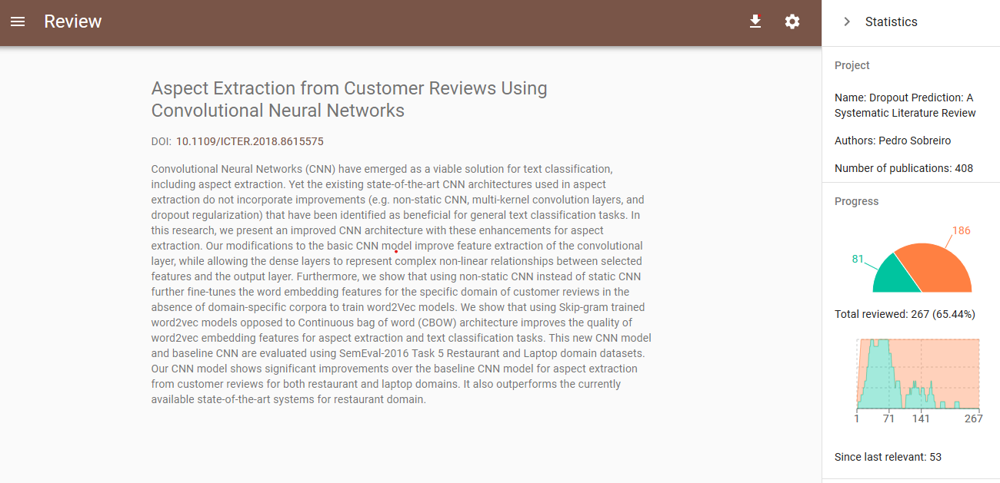

This is an [R Markdown](http://rmarkdown.rstudio.com) Notebook. With the cleaning of a dataframe used in a Systematic Review. 


https://cran.r-project.org/web/packages/bibtex/bibtex.pdf

# Import Libraries

```{r message=FALSE, warning=FALSE}
# Setup library

#install.packages("bib2df")
#install.packages('journalabbr')
library(journalabbr)
library(bib2df)
library(bibtex)
library(tibble)
library(dplyr)

setwd('C:/nuvem/Dropbox/doutoramento/tese/SLRDropout/analysis')
```

List all the files with bib extension

```{r}
files<-list.files(path = 'articles/',pattern = '\\.bib$')
files
```
Reading bibtex source files
ACM
```{r warning=FALSE}
acm<-bib2df(file = 'articles/acm.bib')
dim(acm)
```

IEEE
```{r}
ieee<-bib2df(file = 'articles/ieee.bib')
dim(ieee)

```
Messy with 182 columns. Using read.bib instead.

```{r}
ieee<-read.bib('articles/ieee.bib')
write.bib(ieee,'articles/tempieee.bib')
ieee<-bib2df(file = 'articles/tempieee.bib')
dim(ieee)
```

# Science Direct
```{r}
science1<-bib2df(file = 'articles/scienceDirect_withContractual1.bib')
science1
dim(science1)
```
messy with 182 columns. Using read.bib instead.
```{r warning=FALSE}
science1<-read.bib('articles/scienceDirect_withContractual1.bib')
write.bib(science1,'articles/tempscienceDirect_withContractual1.bib')
science1<-bib2df(file = 'articles/tempscienceDirect_withContractual1.bib')
dim(science1)

science2<-read.bib('articles/scienceDirect_withContractual2.bib')
write.bib(science2,'articles/tempscienceDirect_withContractual2.bib')
science2<-bib2df(file = 'articles/tempscienceDirect_withContractual2.bib')
dim(science2)

#merge two dataframes
science <- rbind(science1,science2)
dim(science)

ls() # check object in workspace
#remove dataframes
rm(science1)
rm(science2)
```
Incorrect data discarded 8 incomplete information tot


# Scopus
The data exported from scopus to the bibtex file had a lot of problems and missing data. To solve the problem we used the DOIs to gather the articles info using the Zotero importing feature

```{r warning=FALSE}
#scopus<-read.bib('scopus.bib')
#write.bib(scopus,'tempscopus.bib')
#scopus<-bib2df(file = 'tempscopus.bib')
#dim(scopus)
#names(scopus)


scopus<-read.bib('articles/scopus_zotero.bib')
write.bib(scopus,'articles/tempscopus_zotero.bib')
scopus<-bib2df(file = 'articles/tempscopus_zotero.bib')
dim(scopus)
names(scopus)

```

This code gets the abstract using the paper link
We are going to use (rvest)[http://rvest.tidyverse.org/]
Get the node with abstract using the css selector .c-article-section__content or .Para. An easy way is to identify the css selector is to use the inspector.


```{r}
library(rvest)
library(httr)
library(utils)

springer<-bib2df('articles/springer_Exported Items.bib')

#Replace the abstract with same link
springer$ABSTRACT = ''

print("Progress springer:")
pb = txtProgressBar(min = 0, max = length(springer$URL), initial = 0,); i<-1
#springer$URL
for (x in springer$URL) {
    url<-x
    webpage<-GET(url,timeout(300))
    webpage<-read_html(webpage)
    if(length(html_nodes(webpage,'.c-article-section__content')) != 0)
    {
        abstract<-html_text(html_nodes(webpage,'.c-article-section__content')[1])
    
    } else {
        abstract<-html_text(html_nodes(webpage,'.Para')[1])
    }
    #print(abstract)
    if(length(abstract!=0)) { springer$ABSTRACT[springer$URL==x]=abstract }
    setTxtProgressBar(pb,i)    
    i<-i+1
}

```


# Web of Knowledge
```{r}
wos<-bib2df('articles/webofscience_Exported Items.bib')
wAbstract<-wos[is.na(wos$ABSTRACT),]
dim(wAbstract)
# two articles without abstract
urls<-wAbstract$URL
wos$ABSTRACT[wos$URL==urls[1]]<-'Customer churn management focuses on identifying potential churners and implementing incentives that can cure churn. The success of a churn management program depends on accurately identifying potential churners and understanding what conditions contribute to churn. However, in the presence of uncertainties in the process of churn, such as competing risks and unpredictable customer behaviour, the accuracy of the prediction models can be limited. To overcome this, we employ a competing risk methodology within a random survival forest framework that accurately computes the risks of churn and identifies relationships between the risks and customer behaviour. In contrast to existing methods, the proposed model does not rely on a specific functional form to model the relationships between risk and behaviour, and does not have underlying distributional assumptions, both of which are limitations faced in practice. The performance of the method is evaluated using data from a membership-based firm in the hospitality industry, where customers face two competing churning events. The proposed model improves prediction accuracy by up to 20%, compared to conventional models. The findings from this work can allow marketers to identify and understand churners, and develop strategies on how to design and implement incentives.'

wos$ABSTRACT[wos$URL==urls[2]]<-'Predicting future customer behavior provides key information for efficiently directing resources at sales and marketing departments. Such information supports planning the inventory at the warehouse and point of sales, as well strategic decisions during manufacturing processes. In this paper, we develop advanced analytics tools that predict future customer behavior in the non-contractual setting. We establish a dynamic and data driven framework for predicting whether a customer is going to make purchase at the company within a certain time frame in the near future. For that purpose, we propose a new set of customer relevant features that derives from times and values of previous purchases. These customer features are updated every month, and state of the art machine learning algorithms are applied for purchase prediction. In our studies, the gradient tree boosting method turns out to be the best performing method. Using a data set containing more than 10 000 customers and a total number of 200 000 purchases we obtain an accuracy score of 89% and an AUC value of 0.95 for predicting next moth purchases on the test data set.'

incomplete<-wos$TITLE[is.na(wos$DOI)]

incomplete
wos$DOI[wos$TITLE=="A {Case} of {Churn} {Prediction} in {Telecommunications} {Industry"]='10.1007/978-3-319-10774-5_8'
wos$DOI[wos$TITLE=="Churn {Prediction} {Model} for {Effective} {Gym} {Customer} {Retention"]='10.1109/BESC.2017.8256385'
wos$DOI[wos$TITLE=="Using machine learning techniques to preduct defection of top clients"]='10.2495/DATA020491'

```


# Create a dataframe for analysis
```{r}
acm2<-data.table::copy(acm)
data_articles <- data.frame(acm$CATEGORY,acm$YEAR,acm$TITLE,acm$ABSTRACT,acm$DOI,acm$JOURNAL,acm$BIBTEXKEY,
                            sapply(acm$AUTHOR,FUN=toString))

names(data_articles)<- c('category','year','title','abstract','doi','journal','bibtexkey','author')
data_articles$source <- 'ACM'


#Transform the vector to string
ieee$AUTHOR <- sapply(ieee$AUTHOR,FUN=toString)
science$AUTHOR <- sapply(science$AUTHOR,FUN=toString)
scopus$AUTHOR <- sapply(scopus$AUTHOR,FUN=toString)
springer$AUTHOR <- sapply(springer$AUTHOR,FUN=toString)
wos$AUTHOR <- sapply(wos$AUTHOR,FUN=toString)

#IEEE
if(!exists('ieee2')){
    ieee2<-data.table::copy(ieee) #Copy the dataset
    ieee<-ieee2 %>% select(CATEGORY,YEAR,TITLE,ABSTRACT,DOI,JOURNAL,BIBTEXKEY,AUTHOR )
    names(ieee)<-c('category','year','title','abstract','doi','journal','bibtexkey','author')
    ieee$source <-'IEEE'
    
    data_articles<-rbind(data_articles,ieee)
}  

#SCIENCE
if(!exists('science2')){
    science2<-data.table::copy(science)
    science<-science2 %>% select(CATEGORY,YEAR,TITLE,ABSTRACT,DOI,JOURNAL,BIBTEXKEY,AUTHOR )
    names(science)<-c('category','year','title','abstract','doi','journal','bibtexkey','author')
    science$source <- 'SCIENCE'
  
    data_articles<-rbind(data_articles,science)
}

#SCOPUS
if(!exists('scopus2')){
    scopus2<-data.table::copy(scopus) 
    scopus<-scopus2 %>% select(CATEGORY,YEAR,TITLE,ABSTRACT,DOI,JOURNAL,BIBTEXKEY,AUTHOR )
    names(scopus)<-c('category','year','title','abstract','doi','journal','bibtexkey','author')
    scopus$source <- 'SCOPUS'
  
    data_articles<-rbind(data_articles,scopus)
}

#SPRINGER
if(!exists('springer2')){
    springer2<-data.table::copy(springer)
    springer<-springer2 %>% select(CATEGORY,YEAR,TITLE,ABSTRACT,DOI,JOURNAL,BIBTEXKEY,AUTHOR )
    names(springer)<-c('category','year','title','abstract','doi','journal','bibtexkey','author')
    springer$source <- 'SPRINGER'

    data_articles<-rbind(data_articles,springer)
}

#WOS
if(!exists('wos2')){
    wos2<-data.table::copy(wos) #Copy the dataset
    wos<-wos2 %>% select(CATEGORY,YEAR,TITLE,ABSTRACT,DOI,JOURNAL,BIBTEXKEY,AUTHOR )
    names(wos)<-c('category','year','title','abstract','doi','journal','bibtexkey','author')
    wos$source <- 'WOS'

    data_articles<-rbind(data_articles,wos)
}

str(data_articles)
data_articles
```

#Final cleanup
```{r warning=FALSE}
#Check null abstracts
#View(data_articles[is.na(data_articles$abstract),])

missing_abstracts<-data_articles$doi[is.na(data_articles$abstract)]
missing_abstracts

# science
# DOI: https://doi.org/10.1016/B978-0-12-804291-5.00027-1 is a book remove
dim(data_articles)
data_articles<-data_articles[!data_articles$doi=="https://doi.org/10.1016/B978-0-12-804291-5.00027-1",]

#Vamos remover linhas com NAN doi,source and title
data_articles<-data_articles[complete.cases(data_articles[,c('doi','source','title')]),]

data_articles$abstract[data_articles$doi=="10.1109/ICSCEE.2018.8538420"] = 'Customer churn refers to when a customer ceases their relationship with a company. A churn rate, used to estimate growth, is now considered as important a metric as financial profit. With growing competition in the market, companies are desperate to keep the churn rate as low as possible. Thus, churn prediction has gained critical importance, not just for existing customers, but also for predicting trends of future customers. This paper demonstrates prediction of churn on a Telco dataset using a Deep Learning Approach. A multilayered Neural Network was designed to build a non-linear classification model. The churn prediction model works on customer features, support features, usage features and contextual features. The possibility of churn as well as the determining factors are predicted. The trained model then applies the final weights on these features and predict the possibility of churn for that customer. An accuracy of 80.03% was achieved. Since the model also provides the churn factors, it can be used by companies to analyze the reasons for these factors and take steps to eliminate them.'

#doi 10.2174/1874479611003010028
data_articles$abstract[data_articles$doi=="10.2174/1874479611003010028"] = 'Customer churn prediction is one of the most important problems in customer relationship management (CRM). Its aim is to retain valuable customers to maximize the profit of a company. To predict whether a customer will be a churner or non-churner, there are a number of data mining techniques applied for churn prediction, such as artificial neural networks, decision trees, and support vector machines. This paper reviews some recent patents along with 21 related studies published from 2000 to 2009 and compares them in terms of the domain dataset used, data pre-processing and prediction techniques considered, etc. Future research issues are discussed.'

dim(data_articles)

str(data_articles)
head(data_articles[data_articles$year==2021,])

data_articles <- data_articles[!data_articles$year==2021,]


# Remove { or } from title
# Escape metacaracthers in R is with \\
data_articles$title<-gsub("\\{|\\}","",data_articles$title)
data_articles$author<-gsub("\\{|\\}","",data_articles$author)


```

# Records to analyse
```{r warning=FALSE}
print(paste('acm:',dim(acm)[1]))
print(paste('ieee',dim(ieee)[1]))
print(paste('scopus',dim(scopus)[1]))
print(paste('science',dim(science)[1]))
print(paste('springer',dim(springer)[1]))
print(paste('wos',dim(wos)[1]))
print(paste('all',dim(data_articles)[1]))

```
# Articles by source
```{r barplot_source, warning=FALSE}
#Create contigency table for source column
unique(data_articles$source)
tb<-table(data_articles$source)
#Change names
tb
names(tb)
names(tb)[1]='ACM'
names(tb)[2]='IEEE'
names(tb)[3]='Science'
names(tb)[4]='Scopus'
names(tb)[5]='Springer'
names(tb)[6]='WOS'
# barplot with articles by source
bb<-barplot(height = tb,ylim = c(0,250),las=1)
text(x = bb,y = tb+10,labels = tb)
```
# Articles by year
```{r barplot_year, warning=FALSE}
#Create contigency table for source column
unique(data_articles$year)
tb<-table(data_articles$year)
#Change names
tb
# barplot with articles by year
bb<-barplot(height = tb,ylim = c(0,250),las=1)
text(x = bb,y = tb+10,labels = tb)
```


# Export
```{r}
library(xlsx)

write.xlsx(data_articles,'data_articles.xlsx')

```


# Remove duplicates
```{r}
print(paste('Articles:',nrow(data_articles)))

temp<-data_articles %>% distinct(doi,.keep_all = TRUE)


```

```{r}
df2bib(data_articles,file = 'data_articles.bib')

```


# Parsifal Processing

This part is a bit messy. Edit the exported bibtex file and correct some items using sublime the bibtype, because is not placed after '@'. The study was imported to a final list.

1. Export to bibtex to import in Parsifal
2. The number of articles being processed where 424. Duplicates identified 16.
3. Exported to articlesParsifal.xls

https://asreview.readthedocs.io/en/latest/datasets.html#data-format

1. Imported articles to asreview
2. Selected randomly some articles as relevant and irrelevant, at least 5 each. ASReview suggests when to stop
3. [Start reviewing](https://asreview.readthedocs.io/en/latest/quicktour.html#start-reviewing) selecting relevant and irrelevant articles, when starts only to suggest irrelevant articles whe can stop
4. Stop the review when [stopping criterium](https://asreview.readthedocs.io/en/latest/quicktour.html#stop-reviewing) "ASReview orders the publications in such a way that you see the most relevant publications first. In other words, there is a point where you can be confident that you have seen (almost) all publications you need, and you can stop reviewing. When to stop is left to the user. A stopping criterium could be stopping after the last X presented abstracts were labeled irrelevant, or if your time is up. You can use the chart in the statistics panel to follow your progress"

Data requirements for ASReview:
* title 
* abstract 


```{r}
# Bibtex export Parsifal
df2bib(data_articles,file = 'articles/parsifal_data_articles.bib')

# 
data_parsifal<-read.xlsx('articles/articlesParsifal.xls',sheetIndex = 1)


data_parsifal<-data_parsifal %>% filter(status=='Accepted') %>% select(title, abstract, author, doi)

# format to asreview
names(data_parsifal)<-c('title','abstract','authors','doi')

write.xlsx(data_parsifal,'articles/articles_asreview.xlsx')

```

#ASReview final dataset

The analysis with ASReview endeded with 81 articles until we find a stop criterium



Select only select articles
```{r}
data_asreview <- read.xlsx2(file = "asreview/asreview_result_dropout-prediction-a-systematic-literature-review.xlsx",sheetIndex = 1,)
str(data_asreview)
data_asreview <- data_asreview[data_asreview$final_included==1,]

str(data_asreview)

```
```{r}
text<-as.character(data_asreview$doi)
text

writeClipboard(text)

length(text)
```

# Final list 78 records 

```{r}
data_asreview %>% select(title,doi) %>% distinct(title,.keep_all = TRUE) %>% arrange(title)
```


EXPORT THE FINAL LIST TO DO T

